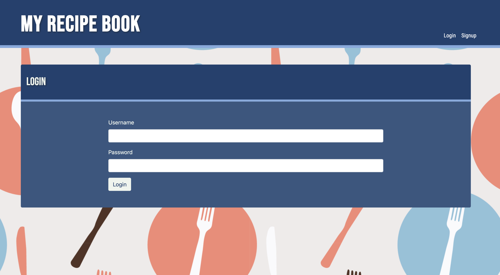
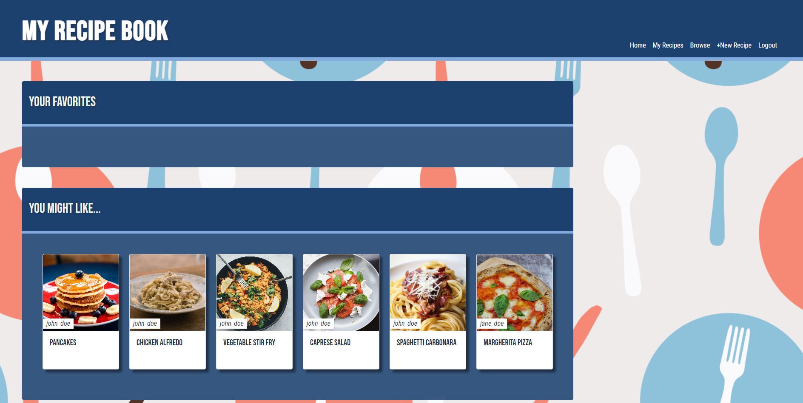
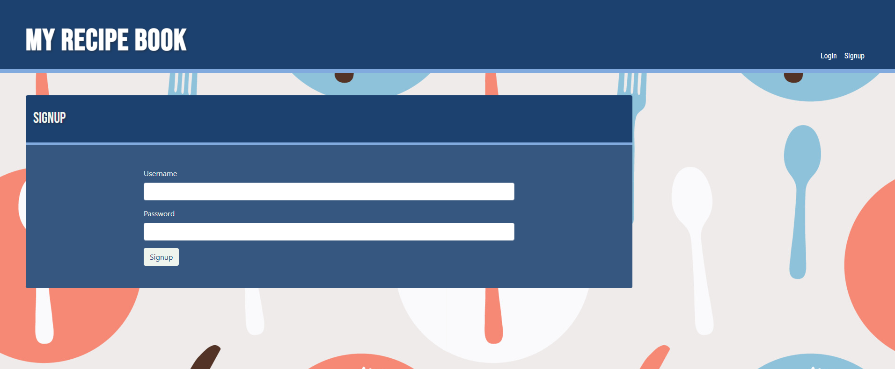
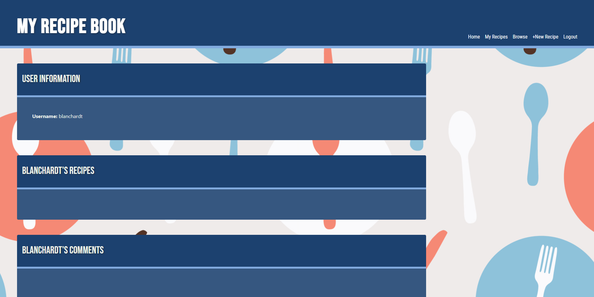
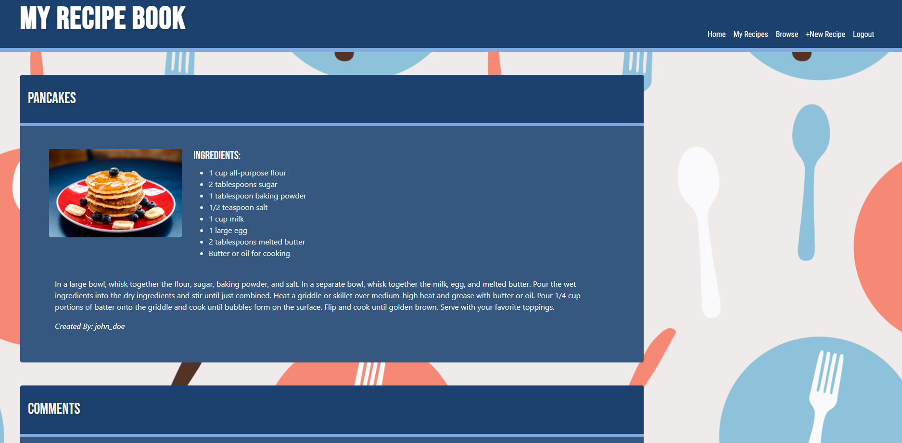
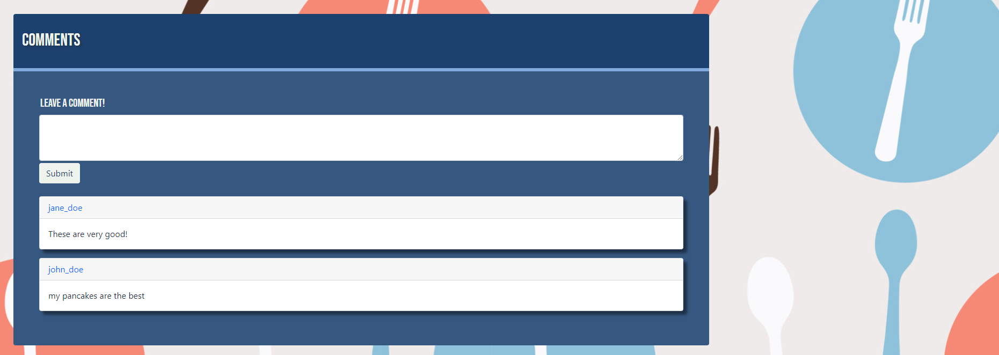

# Group Recipe Book
  

## Description  
An application that can be used to store your favorite recipes. Users can add their own recipes to easily store their favorites. Users can sign up and login to save their information so it’s all in one convenient spot. This application was created so that there is a new convenient way to share and store recipies. This will also help with indecisiveness when choosing a meal. 

## Table of Contents  
* [Installation](#installation)  
* [Usage](#usage)  
* [Credits](#credits)  
* [License](#license)  
* [Contributing](#contributing) 
* [Questions](#questions)

## Installation  
To install necessary dependencies, run the following command:  

```  
npm install  
```  

## Usage  
Users are able to log in and out.  Once logged in they are able to view all of their recipes along with other peoples recipes.  They are even able to create their own recipe.  
Login page:   
   
Homepage:   
   
Signup page:    
     
My Recipe page:   
  
Recipe Page:  
   
    
Dashboard:   
    
Create New Recipe:   
   

## Credits
Collaborators:
Zel Star (https://github.com/zelstart)
Trevor Blanchard (https://github.com/blanchardt)
Chris Sullivan (https://github.commy/chris-sully)

GitHub Repo: https://github.com/blanchardt/group-recipe-book  
GitHub Original Repo: https://github.com/zelstart/my-recipe-book  
Live Site: https://group-recipe-book-e481e1d25621.herokuapp.com/  
Original Live Site: https://myrecipebook-ztc-5e1e57d00e6c.herokuapp.com/newrecipe  

Unsplash- uesed for the pictures of food (https://unsplash.com/)

Vecteezy- used for background piacture (https://www.vecteezy.com/)

Multer- used for file uploads (https://www.npmjs.com/package/multer)

Youtube- used for extra multer comprehension (https://www.youtube.com/watch?v=EVOFt8Its6I)

UNH Bootcamp- used for README (https://bootcampspot.instructure.com/courses/3906/pages/3-dot-5-3-create-a-professional-project-readme?module_item_id=885925)

### Breakdown of Tasks
Zel- HTML, CSS, Models
Trevor- Multer and Javascript
Chris- Controller and Api routes and README

## License  
This project is licensed under the MIT license.  

## Questions  
If you have any questions about the repo, open an issue or contact me directly at blanchardt@merrimack.edu.  You can find more of my work at [blanchardt](https://github.com/blanchardt/).  
